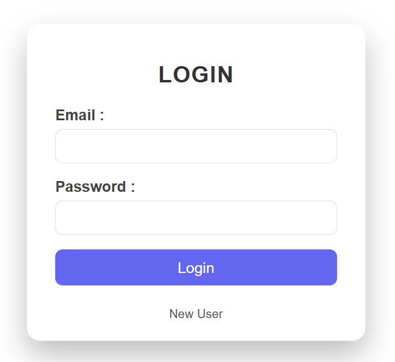
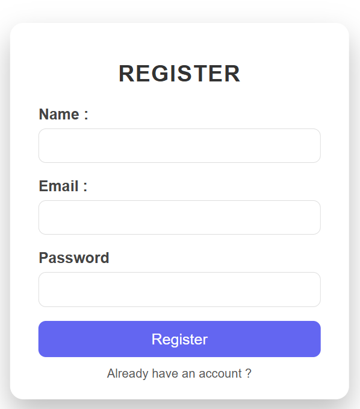
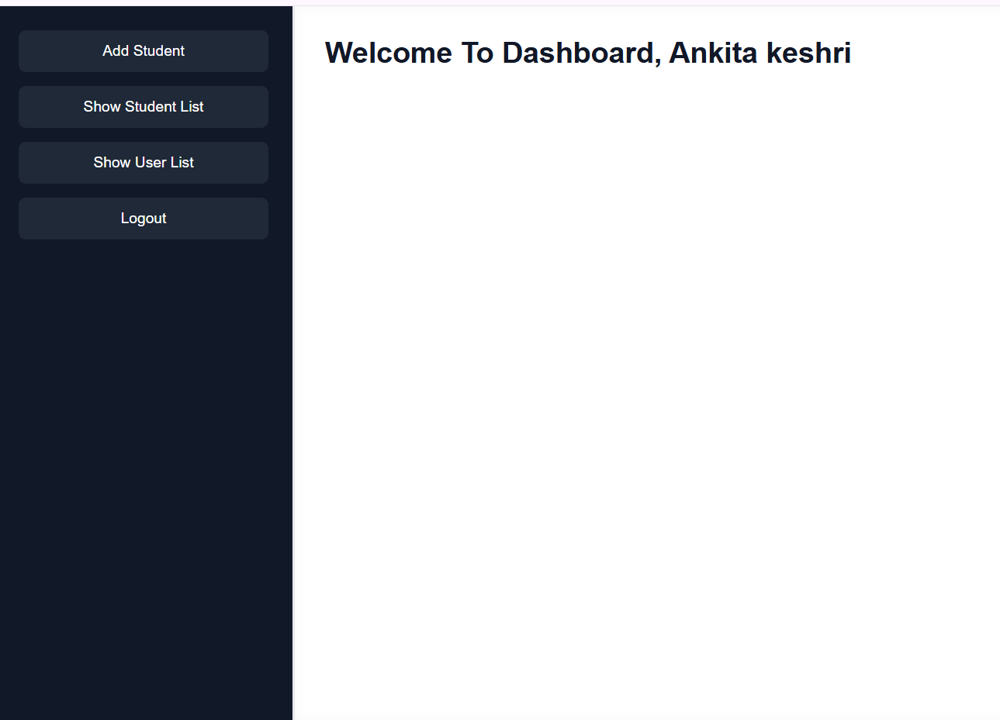
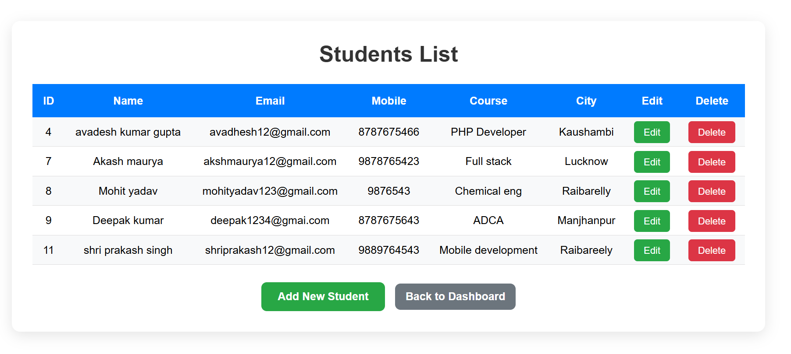
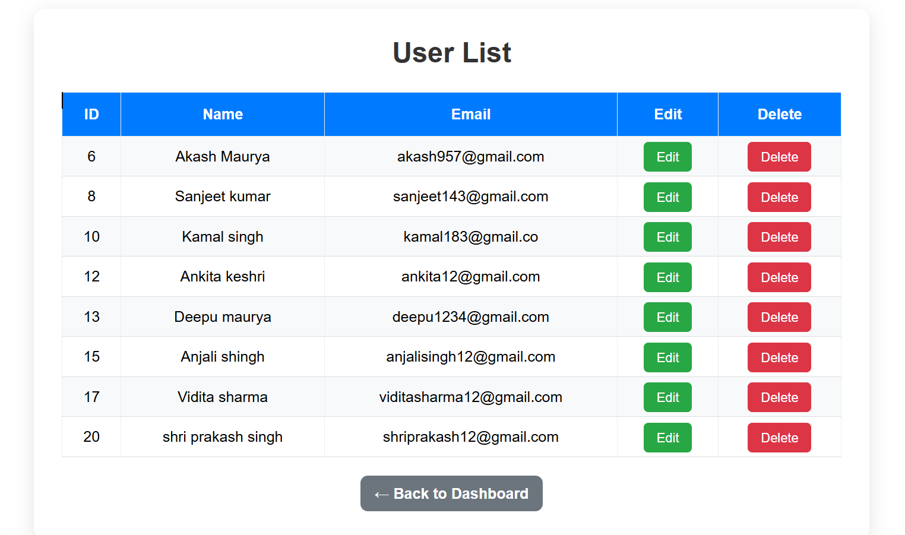
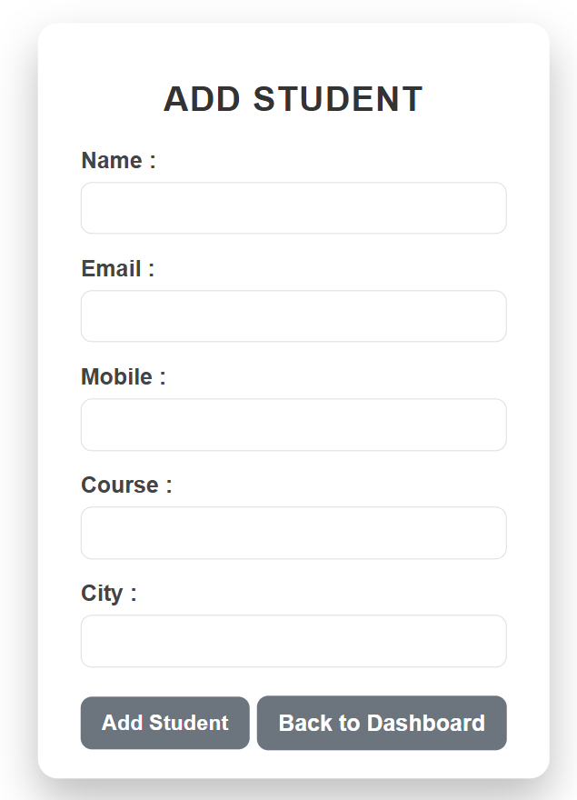

# 👨‍🎓 User & Student Management System

A PHP MVC-based web application for managing users and students with MySQL database integration.

---

## 🚀 Features

- User Registration (Sign Up)
- User Authentication (Login / Logout)
- User Profile Management (Update Name & Email)
- Dashboard Access after Login
- Add, Edit, Delete Students
- Manage Users and Students from Dashboard
- MVC Architecture Implementation
- Secure Database Handling (MySQL)

---

## 🛠️ Technologies Used

- PHP (MVC Pattern)
- MySQL
- HTML5
- CSS3
- Apache (XAMPP)

---

## 📂 Project Structure

controllers/ → Application logic  
models/ → Database queries  
views/ → UI files  
config/ → Database configuration  
database/ → SQL dump file  

---

## 📸 Screenshots

### 🔐 Login Page

### 📝 Registration Page

### 📊 Dashboard

### 👨‍🎓 Student List

### 👨‍🎓 User List

### 👨‍🎓 Add Student List

---

## ⚙️ Setup Instructions

1. Clone repository
2. Import `database.sql` in phpMyAdmin
3. Start XAMPP (Apache + MySQL)
4. Run project on:
http://localhost/database_php_project/userAndStudent_management_system

---

## 👨‍💻 Author

Sandeep Keshri
